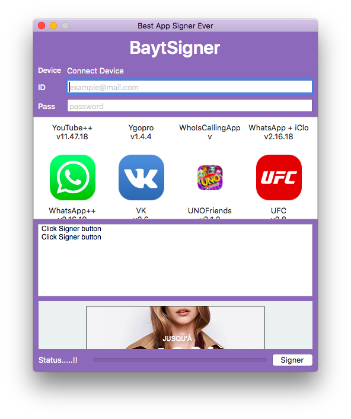

## Lite version of BaytApps.net

You can get and request apps to be signed for free using your free developer account

<p align="center">
  
</p>

### Instructions

### 1. Install Homebrew ( if not installed )
### 2. Install ideviceinstaller + libimobildedevice using the following commands ( even if you have them before ) commands should be executed in order :)

```markdown

- brew uninstall ideviceinstaller
- brew uninstall libimobiledevice
- brew install --HEAD libimobiledevice
- brew link --overwrite libimobiledevice
- brew install ideviceinstaller
- brew link --overwrite ideviceinstaller

```

### 3. restart the application after installing ideviceinstaller
### 4. will ask permission to get your twitter account ( important for Trial usage )
### 4. connect your device 
### 5. put your apple free developer account information
### 6. ( the app will request from you tweet each week to continue using it ) ( click on signer then tweet to activate the trial period )
### 7. after tweeting and puting your developer account info ( choose the app you want )
### 8. we will resign the app requested and will download it after in your mac
### 9. after finishing the download process click ( Extract )
### 10. after extracting the app files ( click Install ) [ And wait ] 


### Request app ?

send me email: mokhleshussien@aol.com

For more details see [iMokhles Site](http://imokhles.com/) [@iMokhles Twitter](http://twitter.com/imokhles).

### Credits
libimobiledevice creator

iMokhles

BaytApps.Net
